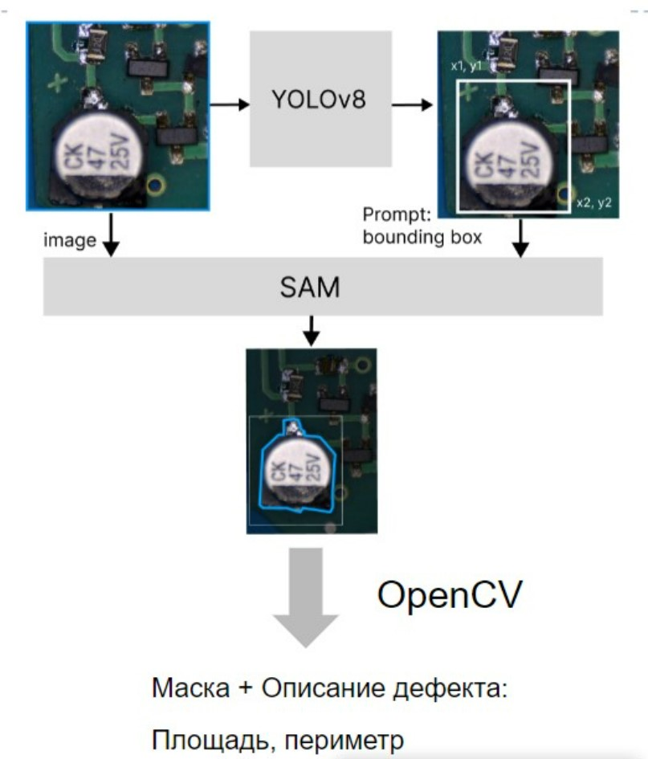

# Логика пайплайна

# Обработка данных
- Анализ исходного датасета: \`data_analysis.ipynb\`
- Аугментация данных: \`data_augmentation.ipynb\`
- Предобработка датасета: \`data_preprocessing.ipynb\`

# Расчет метрик
Расчет метрик precison, recall, mAP50 \
count_metrics.ipynb

# Модель YOLO+MobileSam
yolo_sam_model.ipynb

# Обучение 
yolo_cli.ipynb

# Вспомогательные функции для работы модели
model_utils.ipynb

# Вспомогательные функции для работы с масками
show_masks.ipynb
